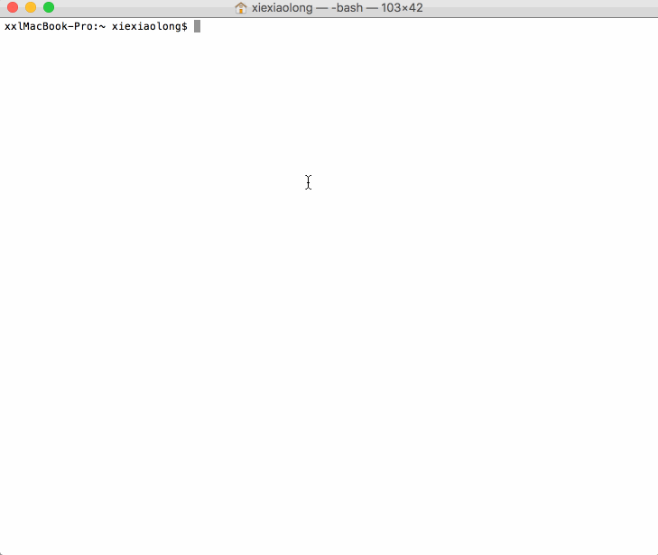

# AutomaticCode-Python
### autoModel.py
`自动生成接口数据的模型类.h和.m文件，测试环境Python 3.4.4，类名需要手动修改`
>   用python写的根据json数据自动创建`.h`和`.m`文件脚本，使用前请配置`#configuration`中间的全局变量: 
`eg:`
 *  outPutPath = '/Users/xiexiaolong1/Desktop/python/' `#.h和.m输出路径,不填默认输出到当前用户桌面` 
 *  jsonPath = '/Users/xiexiaolong1/Desktop/python/json.txt' `#json数据文件路径` 
 *  fileName = 'ContactModel' `#新建.h .m 文件名` 
 *  mark = 'm_' `#给字段加标识` 
 *  className = 'Model' `#模型类名(需要手动修改)` 
 
 >>用法:打开终端-进入autoModel.py所在的目录-执行`python3 autoModel.py`
 ***前提要安装python3，并完成以上配置***
 
